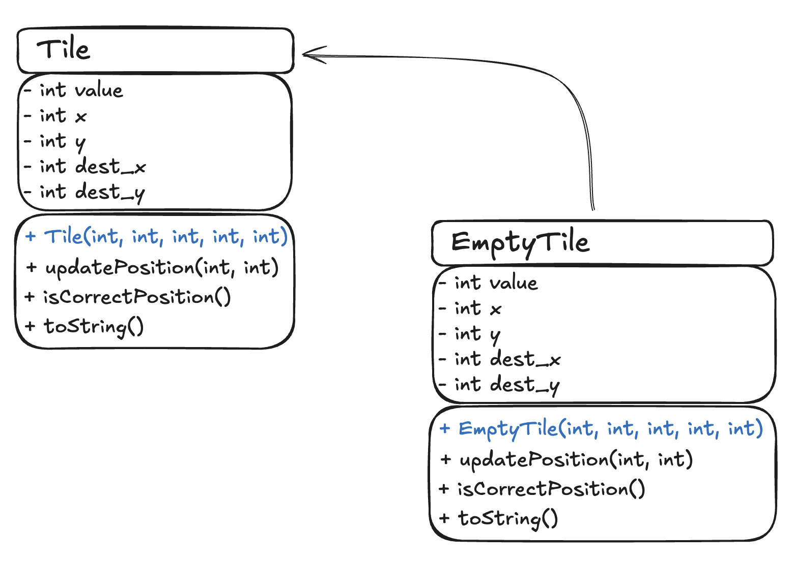

# CS 611 Assignment 1

## Sliding Puzzle Board

### Student information

- Name: Wyatt Napier
- Email: wnapier@bu.edu
- BUID: U52209796

### File Information

- Game.java: contains main logic of running the game
- Board.java: board setup and tile shuffling
- Tile.java: holds tile values and updates them
- EmptyTile.java: specific extension of Tile.java

### Notes

- If I had the time, I would've liked to add an implementation of A\* to calculate the minimum number of moves required to solve the board.
- I thought that a smart choice that I made was to shuffle the board from a solved state to generate the randomized initial state. This way, it is guaranteed that the puzzle is solvable.
- I also included the option to press 'w' as your input tile to move which instantly wins the game so that graders can see the final state more easily. I normally would remove this before publishing the game.
- Additionally, if I knew how to make enums in Java, this would've been a great place to use them.
- I decided to try to maintain the methods for altering a state at the same level as it was maintained such as swapping tiles being within the board class

### Compilation and run directions for the terminal

1. Unzip the files and `cd` to directory with the game files (named SlidingPuzzle for me)
2. run `javac --release 8 *.java` to complie the Java code and ensure it is compatible with Java 8
3. `java Game` to run the code

### Source citations

https://www.geeksforgeeks.org/java/generating-random-numbers-in-java/

https://medium.com/@AlexanderObregon/executing-java-code-from-the-command-line-d6a3c09bb565

### I/O example

```
Output: Welcome to my sliding puzzle game! What is your name?

Input: Wyatt

Output: Wyatt, how many rows for the board?

Input: 2

Output: Wyatt, how many columns for the board?

Input: 2

Output:
+---+---+
|   | 2 |
+---+---+
| 1 | 3 |
+---+---+

Enter the tile number to move:

Input: 3

Output: Invalid move. Enter the tile number to move:

Input: 1

Output:
+---+---+
| 1 | 2 |
+---+---+
|   | 3 |
+---+---+

Enter the tile number to move:

Input: 3

Output:
+---+---+
| 1 | 2 |
+---+---+
| 3 |   |
+---+---+

Congratulations! You've won the game!
It only took you 2 moves to win your last game!
You've won 1 game!

Would you like to play again? [y/n]

Input: n

Output: Thanks for playing!
```

### Design documentation

#### Class structure UML



All other classes are standalone and don't have any inheritance as of now.

#### Scalability and extendibility

My design is well suited for scalability and extendibility because this game isn't strictly the basic 3x3 version. Instead, each dimension can range from 2 to 9 because this prohibits a user from creating a 1x1 puzzle which would only have the empty tile, and it also ensures that all tile values will be at most 2 digits to maintain formatting. This is enforced by prompting a user to enter a new value if their's doesn't conform to the constraints.

Additionally, you can see that by creating classes Board and for Tile, I can then extend them for different specific games or tile types as you can see with the empty tile. This will provide a good foundations for my future assignments to build on if we are to build a relatively similar turn-based board games, especially because my implementation has a player and loops over 1 move at a time.

I also ensured that it is correct by verifying user inputs and when creating the shuffled board, starting from a completed state and executing random moves until reaching a shuffled state.
