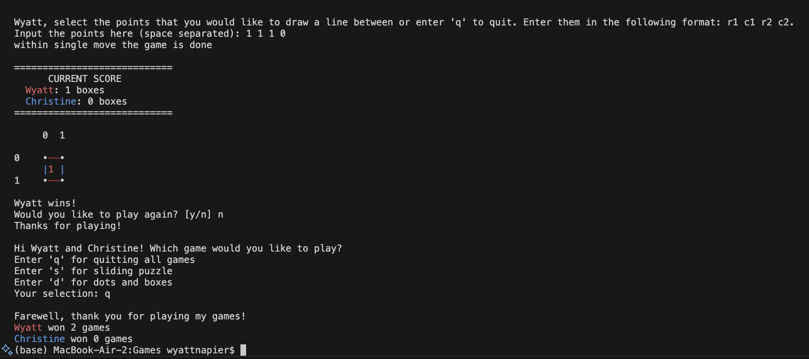

# CS 611 Assignment 1

## Sliding Puzzle + Dots and Boxes

### Student information

- Name: Wyatt Napier
- Email: wnapier@bu.edu
- BUID: U52209796

### File Information

##### Core Files

- Driver.java: main entry point for the game application. It runs the game and controls the very high level control flow, outside of individual games
- Game.java: contains main logic of running the game
- Board.java: used to established some shared instance variables for boards and build a template for important functions that all boards must implement
- Player.java: used to manage players of games
- Tile.java: blueprint of basic methods that tiles need

##### Sliding Puzzle Files

- SlidingPuzzleGame.java: runs the main logic of the sliding puzzle game
- SlidingPuzzleBoard.java: board specific to sliding puzzle game
- SlidingPuzzleTile.java: general tile specific to sliding puzzle game
- SlidingPuzzleEmptyTile.java: specific extension of SlidingPuzzleTile.java for the empty tile

##### Dots and Boxes Files

- DotsAndBoxesGame.java: runs the main logic of the dots and boxes game
- DotsAndBoxesBoard: board specific to dots and boxes - holds most important state
- DotsAndBoxesTile: tile specific to dots and boxes
- DotsAndBoxesEdge: edge for tiles that implements basic functionality for dots and boxes game

##### Other Support Files

- LineEndpoints.java: creates line endpoint objects for reasons listed in notes section
- Input.java: handles getting user input
- Output.java: simple class for cleanly printing some basic outputs
- DotsAndBoxesOwnershipEnum.java: enum for ownership of an edge/tile in dots and boxes game
- MoveOutcomeEnum.java: enum for outcome of a single move in a game

### Notes

I chose to use multiple enums so that the state within certain class levels would stay just within that class and reduce coupling. It also helps with using switch cases and ensuring that everything is covered.

I chose to use a map of line endpoints to edges and edges to tiles because this way you can start with line endpoints that will be marked which will then allow the program to access the appropriate edge, mark it, and then look up the tile it belongs to in the other map and check if that tile is now complete. It makes the whole game flow much easier by interacting directly with edges rather than trying to work through tiles to do this all.

Also, to simplify interacting with edges I created the lineEndpoints class and use a single int for each coordinate (calculated by `row \* 10 + column`) because it reduces the number of variables that are passed around. When really needed, each int point can still be decomposed into row and column components.

If I had more time I would move more of my printing outputs to the new Output file.

### Compilation and run directions for the terminal

1. Unzip the files and `cd` to directory with the game files (named Games for me)
2. execute `./run.sh`

### Source citations

- https://www.geeksforgeeks.org/java/stringbuilder-class-in-java-with-examples/
- https://www.geeksforgeeks.org/java/interfaces-in-java/
- https://www.w3schools.com/java/java_enums.asp

### I/O example

```
Welcome to my board games! This program allows users to play multiple different types of board games such as Sliding Puzzle and Dots and Boxes.
Player 1 username: Wyatt

Hi Wyatt! Which game would you like to play?
Enter 's' for sliding puzzle
Enter 'd' for dots and boxes
Your selection: s

Enter the number of rows for the board (2-9): 2

Enter the number of columns for the board (2-9): 2

+---+---+
|   | 2 |
+---+---+
| 1 | 3 |
+---+---+

Wyatt, enter the tile number to move or 'q' to quit: 1

+---+---+
| 1 | 2 |
+---+---+
|   | 3 |
+---+---+

Wyatt, enter the tile number to move or 'q' to quit: 3

+---+---+
| 1 | 2 |
+---+---+
| 3 |   |
+---+---+

Congratulations! You've won the game!
It only took you 2 moves to win your last game!
You've won 1 games!

Would you like to play again? [y/n] n
Thanks for playing!

Hi Wyatt! Which game would you like to play?
Enter 'q' for quitting all games
Enter 's' for sliding puzzle
Enter 'd' for dots and boxes
Your selection: d

Player 2 username: Christine

Enter the number of rows for the board (1-9): 1

Enter the number of columns for the board (1-9): 1


============================
      CURRENT SCORE
  Wyatt: 0 boxes
  Christine: 0 boxes
============================

     0  1

0    •  •

1    •  •


Christine, select the points that you would like to draw a line between or enter 'q' to quit. Enter them in the following format: r1 c1 r2 c2.
Input the points here (space separated): 0 0 1 0

============================
      CURRENT SCORE
  Wyatt: 0 boxes
  Christine: 0 boxes
============================

     0  1

0    •  •
     |
1    •  •


Wyatt, select the points that you would like to draw a line between or enter 'q' to quit. Enter them in the following format: r1 c1 r2 c2.
Input the points here (space separated): 0 0 0 1

============================
      CURRENT SCORE
  Wyatt: 0 boxes
  Christine: 0 boxes
============================

     0  1

0    •──•
     |
1    •  •


Christine, select the points that you would like to draw a line between or enter 'q' to quit. Enter them in the following format: r1 c1 r2 c2.
Input the points here (space separated): 0 1 1 1

============================
      CURRENT SCORE
  Wyatt: 0 boxes
  Christine: 0 boxes
============================

     0  1

0    •──•
     |  |
1    •  •


Wyatt, select the points that you would like to draw a line between or enter 'q' to quit. Enter them in the following format: r1 c1 r2 c2.
Input the points here (space separated): 0 0 0 1
You can't place an edge there. Try again.

Wyatt, select the points that you would like to draw a line between or enter 'q' to quit. Enter them in the following format: r1 c1 r2 c2.
Input the points here (space separated): 0 0 1 1
Invalid input. Try again.


Wyatt, select the points that you would like to draw a line between or enter 'q' to quit. Enter them in the following format: r1 c1 r2 c2.
Input the points here (space separated): 1 1 1 0
within single move the game is done

============================
      CURRENT SCORE
  Wyatt: 1 boxes
  Christine: 0 boxes
============================

     0  1

0    •──•
     |1 |
1    •──•

Wyatt wins!
Would you like to play again? [y/n] n
Thanks for playing!

Hi Wyatt and Christine! Which game would you like to play?
Enter 'q' for quitting all games
Enter 's' for sliding puzzle
Enter 'd' for dots and boxes
Your selection: q

Farewell, thank you for playing my games!
Wyatt won 2 games
Christine won 0 games
```

Here is a screenshot from that same set of output to demonstrate the use of color:



### Design documentation

##### Changes From First Assignment

I added the Input and Output classes to try to streamline interacting with the user. I also added a Tile interface for better extendibility and refactored much of the overall game loop for better compartmentalization and thus extendibility as well. I also added a bash script to compile and run the code for better ease of use.

##### Scalability and Extendibility

I have an interface for the Tiles as well as abstract classes for boards and games. Since the same Player objects need to be used across games I haven't implemented inheritance within them yet, but may add that in some way or create a gamePlayerManager to reduce coupling there as well. All of this allows my program to be extended with relative ease and consistency, alongside the Input and Output classes.

For scalability and correctness, there is redundant input validation, and users can customize their game experience such as board size or the selected player to play one person games such as the SlidingPuzzleGame. This can continue to be scaled across multiple games, especially due to the usage of maps in the driver for selecting games and the switch statements that reduce the visual clutter of multiple if/else statements.

##### UML

[UML Diagram](https://lucid.app/lucidspark/cb31ba88-8403-40e6-89a6-f3e04e2bd4f2/edit?viewport_loc=-457%2C-143%2C6170%2C2573%2C0_0&invitationId=inv_e431e58f-a287-4193-9f46-8af9a8f42078)
