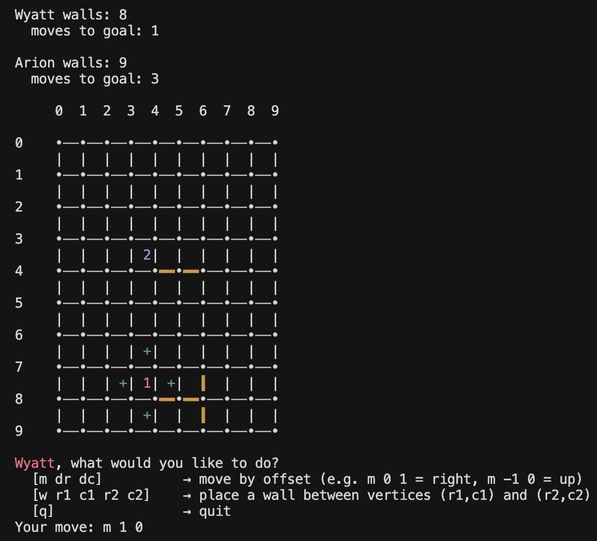

# CS 611 Assignment 3

## Sliding Puzzle + Dots and Boxes + Quoridor

### Student information

- Names: Wyatt Napier, Arion Tripathi
- Emails: wnapier@bu.edu, arionct@bu.edu
- BUIDs: U52209796, U75335719 (respectively)

### File Information

##### Core Files

- Main.java: program entry point that starts the driver
- Driver.java: main entry point for the game application. It runs the game and controls the very high level control flow, outside of individual games
- Game.java: contains main logic of running the game
- Board.java: used to established some shared instance variables for boards and build a template for important functions that all boards must implement
- Player.java: used to manage players of games
- Tile.java: blueprint of basic methods that tiles need

##### Sliding Puzzle Files

- SlidingPuzzleGame.java: runs the main logic of the sliding puzzle game
- SlidingPuzzleBoard.java: board specific to sliding puzzle game
- SlidingPuzzleTile.java: general tile specific to sliding puzzle game
- SlidingPuzzleEmptyTile.java: specific extension of SlidingPuzzleTile.java for the empty tile

##### Dots and Boxes Files

- DotsAndBoxesGame.java: runs the main logic of the dots and boxes game
- DotsAndBoxesBoard.java: board specific to dots and boxes - holds most important state
- DotsAndBoxesTile.java: tile specific to dots and boxes
- DotsAndBoxesEdge.java: edge for tiles that implements basic functionality for dots and boxes game

##### Quoridor Files

- QuoridorGame.java: controls turn flow, reads commands, and decides when the match ends
- QuoridorBoard.java: keeps the full quoridor board state and handles movement, wall placement, and path checks
- QuoridorTile.java: represents one board square and stores the four surrounding edges
- QuoridorEdge.java: models a board edge and tracks whether that edge currently has a wall
- QuoridorPlayer.java: wraps base player info with quoridor position, target row, and remaining walls

##### Other Support Files

- CoordPoint.java: tiny row and col point object used all over board logic
- AnsiColor.java: small helper for terminal color constants and wrapping text
- Edge.java: abstract edge base class shared by game-specific edge types
- LineEndpoints.java: creates line endpoint objects for reasons listed in notes section
- Input.java: handles getting user input
- Output.java: simple class for cleanly printing some basic outputs
- DotsAndBoxesOwnershipEnum.java: enum for ownership of an edge/tile in dots and boxes game
- MoveOutcomeEnum.java: enum for outcome of a single move in a game

### Notes

Wall placement is handled by converting the user endpoints into two adjacent edges through a midpoint check. If either edge is invalid or overlaps an existing wall, the placement is rejected. If placement would block all paths, both edges are rolled back so state stays consistent.

Path legality is enforced with BFS. The same traversal idea is also reused to compute shortest moves to each player’s goal row, which is shown in the board header as "moves to goal" for quick strategy feedback.

I added a small AnsiColor utility in Core so text coloring is centralized instead of repeating raw ANSI strings throughout quoridor classes.

I chose to use multiple enums so that the state within certain class levels would stay just within that class and reduce coupling. It also helps with using switch cases and ensuring that everything is covered.

I chose to use a map of line endpoints to edges and edges to tiles because this way you can start with line endpoints that will be marked which will then allow the program to access the appropriate edge, mark it, and then look up the tile it belongs to in the other map and check if that tile is now complete. It makes the whole game flow much easier by interacting directly with edges rather than trying to work through tiles to do this all.

To simplify coordinate handling, we use a CoordPoint class with row and column fields so movement, wall checks, and BFS logic can pass coordinates cleanly.

If I had more time I would move more of my printing outputs to the new Output file. I would also extend the Input and Output classes for various games.

Potential future additions for Quoridor include: print valid moves as coordinate list in addition to board highlights, offer an optional no color mode, let player move options be up, down, left, right instead of using change of each coordinate for more intuitive use.

### Compilation and run directions for the terminal

1. Unzip the files and `cd` to directory with the game files (named Games for me)
2. execute `./run.sh`

### Source citations

- https://www.geeksforgeeks.org/java/stringbuilder-class-in-java-with-examples/
- https://www.geeksforgeeks.org/java/interfaces-in-java/
- https://www.w3schools.com/java/java_enums.asp
- https://www.geeksforgeeks.org/java/how-to-print-colored-text-in-java-console/

### I/O example

```
Welcome to my board games! This program allows users to play multiple different types of board games such as Sliding Puzzle, Dots and Boxes, and Quoridor.
Player 1 username: Wyatt 

Hi Wyatt! Which game would you like to play? 
Enter 'q' for quoridor
Enter 's' for sliding puzzle
Enter 'd' for dots and boxes
Your selection: q

Player 2 username: Arion
Quoridor is a two player game where your objective is to cross the board. 
You can place walls on the map to slow your opponent down -- first to the other side wins!

Wyatt walls: 10
  moves to goal: 8
 
Arion walls: 10
  moves to goal: 8

     0  1  2  3  4  5  6  7  8  9  

0    •──•──•──•──•──•──•──•──•──•
     |  |  |  | +| 1| +|  |  |  |
1    •──•──•──•──•──•──•──•──•──•
     |  |  |  |  | +|  |  |  |  |
2    •──•──•──•──•──•──•──•──•──•
     |  |  |  |  |  |  |  |  |  |
3    •──•──•──•──•──•──•──•──•──•
     |  |  |  |  |  |  |  |  |  |
4    •──•──•──•──•──•──•──•──•──•
     |  |  |  |  |  |  |  |  |  |
5    •──•──•──•──•──•──•──•──•──•
     |  |  |  |  |  |  |  |  |  |
6    •──•──•──•──•──•──•──•──•──•
     |  |  |  |  |  |  |  |  |  |
7    •──•──•──•──•──•──•──•──•──•
     |  |  |  |  |  |  |  |  |  |
8    •──•──•──•──•──•──•──•──•──•
     |  |  |  |  | 2|  |  |  |  |
9    •──•──•──•──•──•──•──•──•──•

Wyatt, what would you like to do?
  [m dr dc]          → move by offset (e.g. m 0 1 = right, m -1 0 = up)
  [w r1 c1 r2 c2]    → place a wall between vertices (r1,c1) and (r2,c2)
  [q]                → quit
Your move: w 8 4 8 6


Wyatt walls: 9
  moves to goal: 9
 
Arion walls: 10
  moves to goal: 9

     0  1  2  3  4  5  6  7  8  9  

0    •──•──•──•──•──•──•──•──•──•
     |  |  |  |  | 1|  |  |  |  |
1    •──•──•──•──•──•──•──•──•──•
     |  |  |  |  |  |  |  |  |  |
2    •──•──•──•──•──•──•──•──•──•
     |  |  |  |  |  |  |  |  |  |
3    •──•──•──•──•──•──•──•──•──•
     |  |  |  |  |  |  |  |  |  |
4    •──•──•──•──•──•──•──•──•──•
     |  |  |  |  |  |  |  |  |  |
5    •──•──•──•──•──•──•──•──•──•
     |  |  |  |  |  |  |  |  |  |
6    •──•──•──•──•──•──•──•──•──•
     |  |  |  |  |  |  |  |  |  |
7    •──•──•──•──•──•──•──•──•──•
     |  |  |  |  |  |  |  |  |  |
8    •──•──•──•──•━━•━━•──•──•──•
     |  |  |  | +| 2| +|  |  |  |
9    •──•──•──•──•──•──•──•──•──•

Arion, what would you like to do?
  [m dr dc]          → move by offset (e.g. m 0 1 = right, m -1 0 = up)
  [w r1 c1 r2 c2]    → place a wall between vertices (r1,c1) and (r2,c2)
  [q]                → quit
Your move: w 9 6 7 6


Wyatt walls: 9
  moves to goal: 9
 
Arion walls: 9
  moves to goal: 9

     0  1  2  3  4  5  6  7  8  9  

0    •──•──•──•──•──•──•──•──•──•
     |  |  |  | +| 1| +|  |  |  |
1    •──•──•──•──•──•──•──•──•──•
     |  |  |  |  | +|  |  |  |  |
2    •──•──•──•──•──•──•──•──•──•
     |  |  |  |  |  |  |  |  |  |
3    •──•──•──•──•──•──•──•──•──•
     |  |  |  |  |  |  |  |  |  |
4    •──•──•──•──•──•──•──•──•──•
     |  |  |  |  |  |  |  |  |  |
5    •──•──•──•──•──•──•──•──•──•
     |  |  |  |  |  |  |  |  |  |
6    •──•──•──•──•──•──•──•──•──•
     |  |  |  |  |  |  |  |  |  |
7    •──•──•──•──•──•──•──•──•──•
     |  |  |  |  |  |  ┃  |  |  |
8    •──•──•──•──•━━•━━•──•──•──•
     |  |  |  |  | 2|  ┃  |  |  |
9    •──•──•──•──•──•──•──•──•──•

Wyatt, what would you like to do?
  [m dr dc]          → move by offset (e.g. m 0 1 = right, m -1 0 = up)
  [w r1 c1 r2 c2]    → place a wall between vertices (r1,c1) and (r2,c2)
  [q]                → quit
Your move: w 9 4 7 4

You cannot completely trap a player with walls.
Invalid input. Try again.


Wyatt walls: 9
  moves to goal: 9
 
Arion walls: 9
  moves to goal: 9

     0  1  2  3  4  5  6  7  8  9  

0    •──•──•──•──•──•──•──•──•──•
     |  |  |  | +| 1| +|  |  |  |
1    •──•──•──•──•──•──•──•──•──•
     |  |  |  |  | +|  |  |  |  |
2    •──•──•──•──•──•──•──•──•──•
     |  |  |  |  |  |  |  |  |  |
3    •──•──•──•──•──•──•──•──•──•
     |  |  |  |  |  |  |  |  |  |
4    •──•──•──•──•──•──•──•──•──•
     |  |  |  |  |  |  |  |  |  |
5    •──•──•──•──•──•──•──•──•──•
     |  |  |  |  |  |  |  |  |  |
6    •──•──•──•──•──•──•──•──•──•
     |  |  |  |  |  |  |  |  |  |
7    •──•──•──•──•──•──•──•──•──•
     |  |  |  |  |  |  ┃  |  |  |
8    •──•──•──•──•━━•━━•──•──•──•
     |  |  |  |  | 2|  ┃  |  |  |
9    •──•──•──•──•──•──•──•──•──•

Wyatt, what would you like to do?
  [m dr dc]          → move by offset (e.g. m 0 1 = right, m -1 0 = up)
  [w r1 c1 r2 c2]    → place a wall between vertices (r1,c1) and (r2,c2)
  [q]                → quit
Your move: m 1 0


Wyatt walls: 9
  moves to goal: 8
 
Arion walls: 9
  moves to goal: 9

     0  1  2  3  4  5  6  7  8  9  

0    •──•──•──•──•──•──•──•──•──•
     |  |  |  |  |  |  |  |  |  |
1    •──•──•──•──•──•──•──•──•──•
     |  |  |  |  | 1|  |  |  |  |
2    •──•──•──•──•──•──•──•──•──•
     |  |  |  |  |  |  |  |  |  |
3    •──•──•──•──•──•──•──•──•──•
     |  |  |  |  |  |  |  |  |  |
4    •──•──•──•──•──•──•──•──•──•
     |  |  |  |  |  |  |  |  |  |
5    •──•──•──•──•──•──•──•──•──•
     |  |  |  |  |  |  |  |  |  |
6    •──•──•──•──•──•──•──•──•──•
     |  |  |  |  |  |  |  |  |  |
7    •──•──•──•──•──•──•──•──•──•
     |  |  |  |  |  |  ┃  |  |  |
8    •──•──•──•──•━━•━━•──•──•──•
     |  |  |  | +| 2| +┃  |  |  |
9    •──•──•──•──•──•──•──•──•──•

Arion, what would you like to do?
  [m dr dc]          → move by offset (e.g. m 0 1 = right, m -1 0 = up)
  [w r1 c1 r2 c2]    → place a wall between vertices (r1,c1) and (r2,c2)
  [q]                → quit
Your move: m 0 -1


Wyatt walls: 9
  moves to goal: 8
 
Arion walls: 9
  moves to goal: 8

     0  1  2  3  4  5  6  7  8  9  

0    •──•──•──•──•──•──•──•──•──•
     |  |  |  |  | +|  |  |  |  |
1    •──•──•──•──•──•──•──•──•──•
     |  |  |  | +| 1| +|  |  |  |
2    •──•──•──•──•──•──•──•──•──•
     |  |  |  |  | +|  |  |  |  |
3    •──•──•──•──•──•──•──•──•──•
     |  |  |  |  |  |  |  |  |  |
4    •──•──•──•──•──•──•──•──•──•
     |  |  |  |  |  |  |  |  |  |
5    •──•──•──•──•──•──•──•──•──•
     |  |  |  |  |  |  |  |  |  |
6    •──•──•──•──•──•──•──•──•──•
     |  |  |  |  |  |  |  |  |  |
7    •──•──•──•──•──•──•──•──•──•
     |  |  |  |  |  |  ┃  |  |  |
8    •──•──•──•──•━━•━━•──•──•──•
     |  |  |  | 2|  |  ┃  |  |  |
9    •──•──•──•──•──•──•──•──•──•

Wyatt, what would you like to do?
  [m dr dc]          → move by offset (e.g. m 0 1 = right, m -1 0 = up)
  [w r1 c1 r2 c2]    → place a wall between vertices (r1,c1) and (r2,c2)
  [q]                → quit
Your move: m 1 0


Wyatt walls: 9
  moves to goal: 7
 
Arion walls: 9
  moves to goal: 8

     0  1  2  3  4  5  6  7  8  9  

0    •──•──•──•──•──•──•──•──•──•
     |  |  |  |  |  |  |  |  |  |
1    •──•──•──•──•──•──•──•──•──•
     |  |  |  |  |  |  |  |  |  |
2    •──•──•──•──•──•──•──•──•──•
     |  |  |  |  | 1|  |  |  |  |
3    •──•──•──•──•──•──•──•──•──•
     |  |  |  |  |  |  |  |  |  |
4    •──•──•──•──•──•──•──•──•──•
     |  |  |  |  |  |  |  |  |  |
5    •──•──•──•──•──•──•──•──•──•
     |  |  |  |  |  |  |  |  |  |
6    •──•──•──•──•──•──•──•──•──•
     |  |  |  |  |  |  |  |  |  |
7    •──•──•──•──•──•──•──•──•──•
     |  |  |  | +|  |  ┃  |  |  |
8    •──•──•──•──•━━•━━•──•──•──•
     |  |  | +| 2| +|  ┃  |  |  |
9    •──•──•──•──•──•──•──•──•──•

Arion, what would you like to do?
  [m dr dc]          → move by offset (e.g. m 0 1 = right, m -1 0 = up)
  [w r1 c1 r2 c2]    → place a wall between vertices (r1,c1) and (r2,c2)
  [q]                → quit
Your move: m -1 0


Wyatt walls: 9
  moves to goal: 7
 
Arion walls: 9
  moves to goal: 7

     0  1  2  3  4  5  6  7  8  9  

0    •──•──•──•──•──•──•──•──•──•
     |  |  |  |  |  |  |  |  |  |
1    •──•──•──•──•──•──•──•──•──•
     |  |  |  |  | +|  |  |  |  |
2    •──•──•──•──•──•──•──•──•──•
     |  |  |  | +| 1| +|  |  |  |
3    •──•──•──•──•──•──•──•──•──•
     |  |  |  |  | +|  |  |  |  |
4    •──•──•──•──•──•──•──•──•──•
     |  |  |  |  |  |  |  |  |  |
5    •──•──•──•──•──•──•──•──•──•
     |  |  |  |  |  |  |  |  |  |
6    •──•──•──•──•──•──•──•──•──•
     |  |  |  |  |  |  |  |  |  |
7    •──•──•──•──•──•──•──•──•──•
     |  |  |  | 2|  |  ┃  |  |  |
8    •──•──•──•──•━━•━━•──•──•──•
     |  |  |  |  |  |  ┃  |  |  |
9    •──•──•──•──•──•──•──•──•──•

Wyatt, what would you like to do?
  [m dr dc]          → move by offset (e.g. m 0 1 = right, m -1 0 = up)
  [w r1 c1 r2 c2]    → place a wall between vertices (r1,c1) and (r2,c2)
  [q]                → quit
Your move: m 1 0


Wyatt walls: 9
  moves to goal: 6
 
Arion walls: 9
  moves to goal: 7

     0  1  2  3  4  5  6  7  8  9  

0    •──•──•──•──•──•──•──•──•──•
     |  |  |  |  |  |  |  |  |  |
1    •──•──•──•──•──•──•──•──•──•
     |  |  |  |  |  |  |  |  |  |
2    •──•──•──•──•──•──•──•──•──•
     |  |  |  |  |  |  |  |  |  |
3    •──•──•──•──•──•──•──•──•──•
     |  |  |  |  | 1|  |  |  |  |
4    •──•──•──•──•──•──•──•──•──•
     |  |  |  |  |  |  |  |  |  |
5    •──•──•──•──•──•──•──•──•──•
     |  |  |  |  |  |  |  |  |  |
6    •──•──•──•──•──•──•──•──•──•
     |  |  |  | +|  |  |  |  |  |
7    •──•──•──•──•──•──•──•──•──•
     |  |  | +| 2| +|  ┃  |  |  |
8    •──•──•──•──•━━•━━•──•──•──•
     |  |  |  | +|  |  ┃  |  |  |
9    •──•──•──•──•──•──•──•──•──•

Arion, what would you like to do?
  [m dr dc]          → move by offset (e.g. m 0 1 = right, m -1 0 = up)
  [w r1 c1 r2 c2]    → place a wall between vertices (r1,c1) and (r2,c2)
  [q]                → quit
Your move: m -1 0


Wyatt walls: 9
  moves to goal: 6
 
Arion walls: 9
  moves to goal: 6

     0  1  2  3  4  5  6  7  8  9  

0    •──•──•──•──•──•──•──•──•──•
     |  |  |  |  |  |  |  |  |  |
1    •──•──•──•──•──•──•──•──•──•
     |  |  |  |  |  |  |  |  |  |
2    •──•──•──•──•──•──•──•──•──•
     |  |  |  |  | +|  |  |  |  |
3    •──•──•──•──•──•──•──•──•──•
     |  |  |  | +| 1| +|  |  |  |
4    •──•──•──•──•──•──•──•──•──•
     |  |  |  |  | +|  |  |  |  |
5    •──•──•──•──•──•──•──•──•──•
     |  |  |  |  |  |  |  |  |  |
6    •──•──•──•──•──•──•──•──•──•
     |  |  |  | 2|  |  |  |  |  |
7    •──•──•──•──•──•──•──•──•──•
     |  |  |  |  |  |  ┃  |  |  |
8    •──•──•──•──•━━•━━•──•──•──•
     |  |  |  |  |  |  ┃  |  |  |
9    •──•──•──•──•──•──•──•──•──•

Wyatt, what would you like to do?
  [m dr dc]          → move by offset (e.g. m 0 1 = right, m -1 0 = up)
  [w r1 c1 r2 c2]    → place a wall between vertices (r1,c1) and (r2,c2)
  [q]                → quit
Your move: m 1 0


Wyatt walls: 9
  moves to goal: 5
 
Arion walls: 9
  moves to goal: 6

     0  1  2  3  4  5  6  7  8  9  

0    •──•──•──•──•──•──•──•──•──•
     |  |  |  |  |  |  |  |  |  |
1    •──•──•──•──•──•──•──•──•──•
     |  |  |  |  |  |  |  |  |  |
2    •──•──•──•──•──•──•──•──•──•
     |  |  |  |  |  |  |  |  |  |
3    •──•──•──•──•──•──•──•──•──•
     |  |  |  |  |  |  |  |  |  |
4    •──•──•──•──•──•──•──•──•──•
     |  |  |  |  | 1|  |  |  |  |
5    •──•──•──•──•──•──•──•──•──•
     |  |  |  | +|  |  |  |  |  |
6    •──•──•──•──•──•──•──•──•──•
     |  |  | +| 2| +|  |  |  |  |
7    •──•──•──•──•──•──•──•──•──•
     |  |  |  | +|  |  ┃  |  |  |
8    •──•──•──•──•━━•━━•──•──•──•
     |  |  |  |  |  |  ┃  |  |  |
9    •──•──•──•──•──•──•──•──•──•

Arion, what would you like to do?
  [m dr dc]          → move by offset (e.g. m 0 1 = right, m -1 0 = up)
  [w r1 c1 r2 c2]    → place a wall between vertices (r1,c1) and (r2,c2)
  [q]                → quit
Your move: m 0 1


Wyatt walls: 9
  moves to goal: 5
 
Arion walls: 9
  moves to goal: 6

     0  1  2  3  4  5  6  7  8  9  

0    •──•──•──•──•──•──•──•──•──•
     |  |  |  |  |  |  |  |  |  |
1    •──•──•──•──•──•──•──•──•──•
     |  |  |  |  |  |  |  |  |  |
2    •──•──•──•──•──•──•──•──•──•
     |  |  |  |  |  |  |  |  |  |
3    •──•──•──•──•──•──•──•──•──•
     |  |  |  |  | +|  |  |  |  |
4    •──•──•──•──•──•──•──•──•──•
     |  |  |  | +| 1| +|  |  |  |
5    •──•──•──•──•──•──•──•──•──•
     |  |  |  |  | +|  |  |  |  |
6    •──•──•──•──•──•──•──•──•──•
     |  |  |  |  | 2|  |  |  |  |
7    •──•──•──•──•──•──•──•──•──•
     |  |  |  |  |  |  ┃  |  |  |
8    •──•──•──•──•━━•━━•──•──•──•
     |  |  |  |  |  |  ┃  |  |  |
9    •──•──•──•──•──•──•──•──•──•

Wyatt, what would you like to do?
  [m dr dc]          → move by offset (e.g. m 0 1 = right, m -1 0 = up)
  [w r1 c1 r2 c2]    → place a wall between vertices (r1,c1) and (r2,c2)
  [q]                → quit
Your move: w 4 4 4 6


Wyatt walls: 8
  moves to goal: 5
 
Arion walls: 9
  moves to goal: 7

     0  1  2  3  4  5  6  7  8  9  

0    •──•──•──•──•──•──•──•──•──•
     |  |  |  |  |  |  |  |  |  |
1    •──•──•──•──•──•──•──•──•──•
     |  |  |  |  |  |  |  |  |  |
2    •──•──•──•──•──•──•──•──•──•
     |  |  |  |  |  |  |  |  |  |
3    •──•──•──•──•──•──•──•──•──•
     |  |  |  |  |  |  |  |  |  |
4    •──•──•──•──•━━•━━•──•──•──•
     |  |  |  |  | 1|  |  |  |  |
5    •──•──•──•──•──•──•──•──•──•
     |  |  |  |  | +|  |  |  |  |
6    •──•──•──•──•──•──•──•──•──•
     |  |  |  | +| 2| +|  |  |  |
7    •──•──•──•──•──•──•──•──•──•
     |  |  |  |  | +|  ┃  |  |  |
8    •──•──•──•──•━━•━━•──•──•──•
     |  |  |  |  |  |  ┃  |  |  |
9    •──•──•──•──•──•──•──•──•──•

Arion, what would you like to do?
  [m dr dc]          → move by offset (e.g. m 0 1 = right, m -1 0 = up)
  [w r1 c1 r2 c2]    → place a wall between vertices (r1,c1) and (r2,c2)
  [q]                → quit
Your move: m -1 0


Wyatt walls: 8
  moves to goal: 4
 
Arion walls: 9
  moves to goal: 6

     0  1  2  3  4  5  6  7  8  9  

0    •──•──•──•──•──•──•──•──•──•
     |  |  |  |  |  |  |  |  |  |
1    •──•──•──•──•──•──•──•──•──•
     |  |  |  |  |  |  |  |  |  |
2    •──•──•──•──•──•──•──•──•──•
     |  |  |  |  |  |  |  |  |  |
3    •──•──•──•──•──•──•──•──•──•
     |  |  |  |  |  |  |  |  |  |
4    •──•──•──•──•━━•━━•──•──•──•
     |  |  |  | +| 1| +|  |  |  |
5    •──•──•──•──•──•──•──•──•──•
     |  |  |  |  | 2|  |  |  |  |
6    •──•──•──•──•──•──•──•──•──•
     |  |  |  |  | +|  |  |  |  |
7    •──•──•──•──•──•──•──•──•──•
     |  |  |  |  |  |  ┃  |  |  |
8    •──•──•──•──•━━•━━•──•──•──•
     |  |  |  |  |  |  ┃  |  |  |
9    •──•──•──•──•──•──•──•──•──•

Wyatt, what would you like to do?
  [m dr dc]          → move by offset (e.g. m 0 1 = right, m -1 0 = up)
  [w r1 c1 r2 c2]    → place a wall between vertices (r1,c1) and (r2,c2)
  [q]                → quit
Your move: m 2 0


Wyatt walls: 8
  moves to goal: 3
 
Arion walls: 9
  moves to goal: 6

     0  1  2  3  4  5  6  7  8  9  

0    •──•──•──•──•──•──•──•──•──•
     |  |  |  |  |  |  |  |  |  |
1    •──•──•──•──•──•──•──•──•──•
     |  |  |  |  |  |  |  |  |  |
2    •──•──•──•──•──•──•──•──•──•
     |  |  |  |  |  |  |  |  |  |
3    •──•──•──•──•──•──•──•──•──•
     |  |  |  |  |  |  |  |  |  |
4    •──•──•──•──•━━•━━•──•──•──•
     |  |  |  |  | +|  |  |  |  |
5    •──•──•──•──•──•──•──•──•──•
     |  |  |  | +| 2| +|  |  |  |
6    •──•──•──•──•──•──•──•──•──•
     |  |  |  |  | 1|  |  |  |  |
7    •──•──•──•──•──•──•──•──•──•
     |  |  |  |  | +|  ┃  |  |  |
8    •──•──•──•──•━━•━━•──•──•──•
     |  |  |  |  |  |  ┃  |  |  |
9    •──•──•──•──•──•──•──•──•──•

Arion, what would you like to do?
  [m dr dc]          → move by offset (e.g. m 0 1 = right, m -1 0 = up)
  [w r1 c1 r2 c2]    → place a wall between vertices (r1,c1) and (r2,c2)
  [q]                → quit
Your move: m -1 0


Wyatt walls: 8
  moves to goal: 3
 
Arion walls: 9
  moves to goal: 5

     0  1  2  3  4  5  6  7  8  9  

0    •──•──•──•──•──•──•──•──•──•
     |  |  |  |  |  |  |  |  |  |
1    •──•──•──•──•──•──•──•──•──•
     |  |  |  |  |  |  |  |  |  |
2    •──•──•──•──•──•──•──•──•──•
     |  |  |  |  |  |  |  |  |  |
3    •──•──•──•──•──•──•──•──•──•
     |  |  |  |  |  |  |  |  |  |
4    •──•──•──•──•━━•━━•──•──•──•
     |  |  |  |  | 2|  |  |  |  |
5    •──•──•──•──•──•──•──•──•──•
     |  |  |  |  | +|  |  |  |  |
6    •──•──•──•──•──•──•──•──•──•
     |  |  |  | +| 1| +|  |  |  |
7    •──•──•──•──•──•──•──•──•──•
     |  |  |  |  | +|  ┃  |  |  |
8    •──•──•──•──•━━•━━•──•──•──•
     |  |  |  |  |  |  ┃  |  |  |
9    •──•──•──•──•──•──•──•──•──•

Wyatt, what would you like to do?
  [m dr dc]          → move by offset (e.g. m 0 1 = right, m -1 0 = up)
  [w r1 c1 r2 c2]    → place a wall between vertices (r1,c1) and (r2,c2)
  [q]                → quit
Your move: m 1 0


Wyatt walls: 8
  moves to goal: 2
 
Arion walls: 9
  moves to goal: 5

     0  1  2  3  4  5  6  7  8  9  

0    •──•──•──•──•──•──•──•──•──•
     |  |  |  |  |  |  |  |  |  |
1    •──•──•──•──•──•──•──•──•──•
     |  |  |  |  |  |  |  |  |  |
2    •──•──•──•──•──•──•──•──•──•
     |  |  |  |  |  |  |  |  |  |
3    •──•──•──•──•──•──•──•──•──•
     |  |  |  |  |  |  |  |  |  |
4    •──•──•──•──•━━•━━•──•──•──•
     |  |  |  | +| 2| +|  |  |  |
5    •──•──•──•──•──•──•──•──•──•
     |  |  |  |  | +|  |  |  |  |
6    •──•──•──•──•──•──•──•──•──•
     |  |  |  |  |  |  |  |  |  |
7    •──•──•──•──•──•──•──•──•──•
     |  |  |  |  | 1|  ┃  |  |  |
8    •──•──•──•──•━━•━━•──•──•──•
     |  |  |  |  |  |  ┃  |  |  |
9    •──•──•──•──•──•──•──•──•──•

Arion, what would you like to do?
  [m dr dc]          → move by offset (e.g. m 0 1 = right, m -1 0 = up)
  [w r1 c1 r2 c2]    → place a wall between vertices (r1,c1) and (r2,c2)
  [q]                → quit
Your move: m 0 -1


Wyatt walls: 8
  moves to goal: 2
 
Arion walls: 9
  moves to goal: 4

     0  1  2  3  4  5  6  7  8  9  

0    •──•──•──•──•──•──•──•──•──•
     |  |  |  |  |  |  |  |  |  |
1    •──•──•──•──•──•──•──•──•──•
     |  |  |  |  |  |  |  |  |  |
2    •──•──•──•──•──•──•──•──•──•
     |  |  |  |  |  |  |  |  |  |
3    •──•──•──•──•──•──•──•──•──•
     |  |  |  |  |  |  |  |  |  |
4    •──•──•──•──•━━•━━•──•──•──•
     |  |  |  | 2|  |  |  |  |  |
5    •──•──•──•──•──•──•──•──•──•
     |  |  |  |  |  |  |  |  |  |
6    •──•──•──•──•──•──•──•──•──•
     |  |  |  |  | +|  |  |  |  |
7    •──•──•──•──•──•──•──•──•──•
     |  |  |  | +| 1| +┃  |  |  |
8    •──•──•──•──•━━•━━•──•──•──•
     |  |  |  |  |  |  ┃  |  |  |
9    •──•──•──•──•──•──•──•──•──•

Wyatt, what would you like to do?
  [m dr dc]          → move by offset (e.g. m 0 1 = right, m -1 0 = up)
  [w r1 c1 r2 c2]    → place a wall between vertices (r1,c1) and (r2,c2)
  [q]                → quit
Your move: m 0 -1


Wyatt walls: 8
  moves to goal: 1
 
Arion walls: 9
  moves to goal: 4

     0  1  2  3  4  5  6  7  8  9  

0    •──•──•──•──•──•──•──•──•──•
     |  |  |  |  |  |  |  |  |  |
1    •──•──•──•──•──•──•──•──•──•
     |  |  |  |  |  |  |  |  |  |
2    •──•──•──•──•──•──•──•──•──•
     |  |  |  |  |  |  |  |  |  |
3    •──•──•──•──•──•──•──•──•──•
     |  |  |  | +|  |  |  |  |  |
4    •──•──•──•──•━━•━━•──•──•──•
     |  |  | +| 2| +|  |  |  |  |
5    •──•──•──•──•──•──•──•──•──•
     |  |  |  | +|  |  |  |  |  |
6    •──•──•──•──•──•──•──•──•──•
     |  |  |  |  |  |  |  |  |  |
7    •──•──•──•──•──•──•──•──•──•
     |  |  |  | 1|  |  ┃  |  |  |
8    •──•──•──•──•━━•━━•──•──•──•
     |  |  |  |  |  |  ┃  |  |  |
9    •──•──•──•──•──•──•──•──•──•

Arion, what would you like to do?
  [m dr dc]          → move by offset (e.g. m 0 1 = right, m -1 0 = up)
  [w r1 c1 r2 c2]    → place a wall between vertices (r1,c1) and (r2,c2)
  [q]                → quit
Your move: m -1 0


Wyatt walls: 8
  moves to goal: 1
 
Arion walls: 9
  moves to goal: 3

     0  1  2  3  4  5  6  7  8  9  

0    •──•──•──•──•──•──•──•──•──•
     |  |  |  |  |  |  |  |  |  |
1    •──•──•──•──•──•──•──•──•──•
     |  |  |  |  |  |  |  |  |  |
2    •──•──•──•──•──•──•──•──•──•
     |  |  |  |  |  |  |  |  |  |
3    •──•──•──•──•──•──•──•──•──•
     |  |  |  | 2|  |  |  |  |  |
4    •──•──•──•──•━━•━━•──•──•──•
     |  |  |  |  |  |  |  |  |  |
5    •──•──•──•──•──•──•──•──•──•
     |  |  |  |  |  |  |  |  |  |
6    •──•──•──•──•──•──•──•──•──•
     |  |  |  | +|  |  |  |  |  |
7    •──•──•──•──•──•──•──•──•──•
     |  |  | +| 1| +|  ┃  |  |  |
8    •──•──•──•──•━━•━━•──•──•──•
     |  |  |  | +|  |  ┃  |  |  |
9    •──•──•──•──•──•──•──•──•──•

Wyatt, what would you like to do?
  [m dr dc]          → move by offset (e.g. m 0 1 = right, m -1 0 = up)
  [w r1 c1 r2 c2]    → place a wall between vertices (r1,c1) and (r2,c2)
  [q]                → quit
Your move: m 1 0


Wyatt walls: 8
  moves to goal: 0
 
Arion walls: 9
  moves to goal: 3

     0  1  2  3  4  5  6  7  8  9  

0    •──•──•──•──•──•──•──•──•──•
     |  |  |  |  |  |  |  |  |  |
1    •──•──•──•──•──•──•──•──•──•
     |  |  |  |  |  |  |  |  |  |
2    •──•──•──•──•──•──•──•──•──•
     |  |  |  |  |  |  |  |  |  |
3    •──•──•──•──•──•──•──•──•──•
     |  |  |  | 2|  |  |  |  |  |
4    •──•──•──•──•━━•━━•──•──•──•
     |  |  |  |  |  |  |  |  |  |
5    •──•──•──•──•──•──•──•──•──•
     |  |  |  |  |  |  |  |  |  |
6    •──•──•──•──•──•──•──•──•──•
     |  |  |  |  |  |  |  |  |  |
7    •──•──•──•──•──•──•──•──•──•
     |  |  |  |  |  |  ┃  |  |  |
8    •──•──•──•──•━━•━━•──•──•──•
     |  |  |  | 1|  |  ┃  |  |  |
9    •──•──•──•──•──•──•──•──•──•

Wyatt wins!
Would you like to play again? [y/n] n
Thanks for playing!

Hi Wyatt and Arion! Which game would you like to play? 
Enter 'q' for quoridor
Enter 's' for sliding puzzle
Enter 'd' for dots and boxes
Enter 'quit' for quitting all games
Your selection: quit

Farewell, thank you for playing my games!
Wyatt won 1 games
Arion won 0 games
```

Here is a screenshot from that same set of output to demonstrate the use of color:



### Design documentation

##### Changes From First and Second Assignments

On the logic side, we used BFS for path validation after wall placement (to prevent trapping) and for shortest path reporting (moves to goal) so both legality and strategy feedback are built into the board state. We also centralized ANSI coloring in a small helper (AnsiColor) to avoid repeating formatting logic.

##### Scalability and Extendibility

We were able to add a different game in Quoridor while still using the same abstract Game and Board structure, so the core architecture stayed reusable. Quoridor-specific rules are mostly isolated in QuoridorGame and QuoridorBoard, which keeps coupling low. We added valid move highlighting that could be useful for future game-based moves. Also, we generalized the terminal color implementation to be less hard coded and easier to use for future games.

##### UML

[UML Diagram](https://lucid.app/lucidspark/1713a89b-d540-4318-a74e-cacd641972d5/edit?viewport_loc=-1532%2C-488%2C7936%2C3720%2C0_0&invitationId=inv_268bbf3c-d731-48dd-940d-b08ca837219b)
